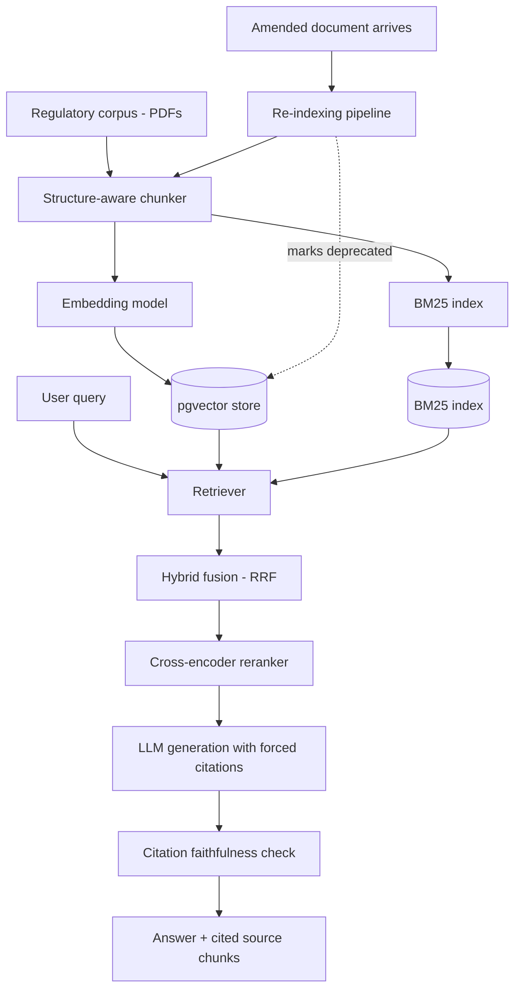
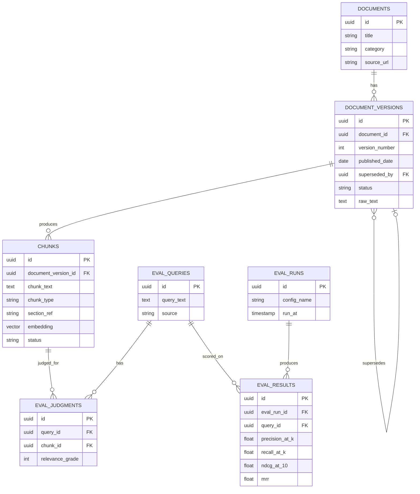

# Regulation-Tracking RAG System — Project Details

## 1. Overview

**What it is**: A retrieval-augmented generation system over Indian financial regulatory documents (RBI Master Circulars / SEBI regulations / GST notifications) that answers compliance-style questions with cited sources, correctly handles documents that amend or supersede earlier ones, and is evaluated with real information-retrieval metrics rather than manual spot-checking.

**Why this domain, specifically**: A single clean PDF has no retrieval difficulty, which means there's nothing genuine to evaluate. Regulatory circulars have three properties a generic PDF doesn't:

1. **They amend and supersede each other** — a 2025 circular can partially override a 2023 one. This creates a real stale-data problem to solve, not a hypothetical one.
2. **Tables mixed with prose** (rate schedules, thresholds, effective dates) — forces genuine chunking-strategy decisions instead of naive fixed-size splitting.
3. **Cross-references** ("as per para 4.2 of circular X") — creates real multi-hop retrieval difficulty.

**Goal**: Demonstrate the actual job of a RAG/AI engineer — proving retrieval quality with numbers, comparing retrieval strategies honestly, and handling the update problem that naive RAG ignores.

**Non-goals for v1**:
- Not a source of legal or financial advice — outputs are for informational/research purposes only (see [Compliance & scope note](#12-compliance--scope-note))
- No multi-tenant access control
- No real-time document ingestion (batch/manual re-indexing trigger is sufficient for this scope)

---

## 2. Tech stack

| Layer | Choice | Why |
|---|---|---|
| Vector storage | **pgvector** extension on Postgres (Neon/Supabase) | Reuses relational infra rather than introducing a dedicated vector DB; a Postgres table with a vector column keeps chunks, metadata, and version status in one queryable place |
| Sparse retrieval | `rank_bm25` (in-memory) or OpenSearch (self-hosted) | Standard, well-understood baseline for lexical matching |
| Dense embeddings | Self-hosted `sentence-transformers` (e.g. BAAI/bge-small-en or intfloat/e5-small) | Free, no rate limits, runs on CPU at this corpus size |
| Fusion | Reciprocal Rank Fusion (RRF) combining BM25 + dense rankings | Standard, simple, well-documented hybrid retrieval technique |
| Reranker | `bge-reranker-base` cross-encoder, self-hosted | Free; reorders the fused top-k candidates by actual relevance to the query |
| Generation LLM | Groq (Llama 3.3) or Gemini Flash | Free tier, low latency |
| Evaluation | `pytrec_eval` or `ranx` + a BEIR benchmark subset (e.g. FiQA-2018) | Real IR tooling rather than hand-rolled metrics |
| Document parsing | `unstructured` or custom parser aware of headers/tables | Preserves document structure instead of flattening to raw text |
| Backend | FastAPI | Query endpoint, ingestion/re-indexing endpoint |
| Hosting | Local dev; Koyeb / Cloud Run free tier for a persistent demo | Consistent with a low-cost deployment approach |

---

## 3. System architecture

---

## 4. Corpus design

- Scope to one narrow sub-area to keep the project tractable — e.g. RBI KYC/AML Master Directions, or a set of GST rate notifications.
- Target 50–150 source documents, spanning at least a few known amendment chains (a document explicitly superseding an earlier one) — this is a hard requirement, not optional, since the re-indexing case study depends on it existing in the corpus.
- Store raw source PDFs plus their publication date and, where stated, which earlier document (if any) they amend or supersede.

---

## 5. Chunking strategy — compared, not assumed

Three chunking configurations are implemented and evaluated against the same query set:

| Strategy | Description | Expected tradeoff |
|---|---|---|
| Fixed-size | Fixed token-length windows with overlap | Simple baseline; risks splitting tables and mid-sentence breaks |
| Recursive/semantic | Splits on paragraph/sentence boundaries, sized to a target token count | Better sentence coherence, still structure-blind |
| Structure-aware | Splits on document headers/sections, keeps tables as atomic chunks, attaches section path as metadata | Expected to preserve context and table integrity best, at the cost of variable chunk sizes |

Each is run through the full retrieval pipeline and scored on the same evaluation set (Section 9) — the report states which one actually wins for this corpus, with numbers, rather than picking one on intuition.

---

## 6. Retrieval architecture — compared, not assumed

Four retrieval configurations, evaluated identically:

1. **BM25 only** — lexical baseline
2. **Dense only** — embedding cosine similarity
3. **Hybrid** — BM25 + dense fused via Reciprocal Rank Fusion
4. **Hybrid + reranking** — RRF candidates re-scored by a cross-encoder reranker

This directly answers the "dense vs hybrid vs reranking, with numbers" bar — the deliverable is a metrics table across all four, not a single chosen pipeline asserted to be best.

---

## 7. Data model

`status` on `chunks` and `document_versions` is either `active` or `deprecated` — deprecated chunks are never deleted, only excluded from default retrieval, preserving an audit trail (matching how real compliance systems handle superseded rules).

---

## 8. Re-indexing / stale-data pipeline

**The case study this enables**: index only the original version of a document that was later amended. Run a query that should surface it and confirm it does. Then push the amendment through this pipeline. Re-run the identical query and confirm the system now surfaces the amended content and no longer surfaces the superseded version by default — while the deprecated chunk remains queryable on request, for audit purposes. Document this with before/after screenshots in the README.

---

## 9. Evaluation methodology — two tracks

**Track A — benchmark credibility**: Run the full retrieval pipeline against an existing IR benchmark with real, pre-existing relevance judgments — e.g. a BEIR finance-domain subset such as FiQA-2018. This is cheap to set up and gives a claim grounded in a named, standard benchmark rather than a self-reported number.

**Track B — domain-specific eval set**: Hand-build 40–60 queries against the actual regulatory corpus, with relevance judgments graded 0 (not relevant) / 1 (partially relevant) / 2 (highly relevant) rather than binary. Document the judging process itself in the README — this is the part most student projects skip entirely, and it's exactly what an IR/search team does before trusting any metric.

**Metrics computed for every experiment**: Precision@k, Recall@k, nDCG@10, MRR — via `pytrec_eval` or `ranx`, not hand-written scoring.

**Experiments run against both tracks**:
- Chunking strategy comparison (Section 5) — one results table
- Retrieval approach comparison (Section 6) — one results table
- Combined best-configuration selection — justified by the numbers from the two tables above, not asserted

---

## 10. Citation faithfulness check

Every generated answer must cite the specific chunk(s) it drew from. A separate automated check verifies that each cited chunk actually contains the claimed fact (a simple entailment/overlap check, or an LLM-as-judge call scoped narrowly to "does this passage support this claim"). Report a faithfulness rate across the evaluation query set — this is a real, current production-RAG concern and is rarely measured in student projects.

---

## 11. Resource / cost notes

Because embeddings and reranking are self-hosted, ongoing cost is close to zero — the main "cost" to track is:

| Resource | Note |
|---|---|
| Self-hosted embedding + reranker inference | CPU time only, no per-call cost |
| LLM generation calls | Free tier (Groq/Gemini); log token usage per query for completeness |
| Postgres + pgvector | Free tier (Neon/Supabase) |

Logging LLM token usage per query, even at zero marginal cost, is worth keeping for consistency with the cost-tracking discipline used elsewhere in the portfolio.

---

## 12. Compliance & scope note

This system answers questions about publicly available regulatory text for informational and research purposes. It is not legal or financial advice, and outputs should not be relied on as a substitute for a qualified professional or the primary source document. This should be stated explicitly in the demo/README, both because it's true and because it forecloses an obvious interview question about production readiness.
