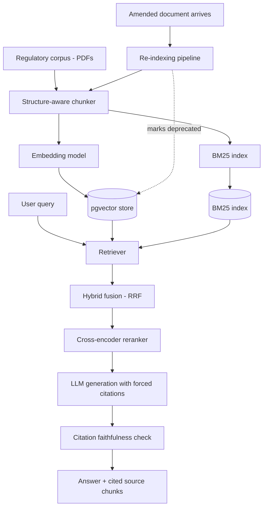

# Regulation-Tracking RAG System

A retrieval-augmented generation system over Indian financial regulatory documents (RBI circulars / SEBI regulations / GST notifications) — built to answer compliance-style questions with cited sources, correctly handle documents that amend or supersede earlier ones, and be evaluated with real information-retrieval metrics instead of manual spot-checking.

This is not a "chat with your PDF" project. The domain was chosen specifically because it has genuine retrieval difficulty: amended/superseded documents, tables mixed with prose, and cross-references between circulars.

**Status**: 🚧 In development.

---

## Table of contents

- [Why this is different from a generic RAG demo](#why-this-is-different-from-a-generic-rag-demo)
- [Architecture](#architecture)
- [Tech stack](#tech-stack)
- [Project structure](#project-structure)
- [Getting started](#getting-started)
- [Evaluation](#evaluation)
- [The stale-data case study](#the-stale-data-case-study)
- [Compliance & scope note](#compliance--scope-note)
- [Further reading](#further-reading)
- [License](#license)

---

## Why this is different from a generic RAG demo

| Generic PDF-chat project | This project |
|---|---|
| One static, clean PDF | A corpus of regulatory documents that genuinely amend and supersede each other |
| "It works when I tried it" | Precision@k, Recall@k, nDCG@10, MRR measured on a held-out query set |
| One chunking approach, unexamined | Three chunking strategies compared head-to-head with numbers |
| One retrieval method | BM25 vs dense vs hybrid vs hybrid+reranking, all measured against the same query set |
| No handling of document updates | An explicit re-indexing pipeline that deprecates superseded content and demonstrably fixes retrieval after an amendment |
| Answers with no way to check correctness | Every answer cites its source chunk, and an automated check verifies the citation actually supports the claim |

## Architecture



Full design detail — chunking comparison methodology, retrieval configurations, the data model, and the re-indexing pipeline — is in [`project-details.md`](./project-details.md).

## Tech stack

| Layer | Choice |
|---|---|
| Vector storage | pgvector on Postgres (Neon/Supabase) |
| Sparse retrieval | `rank_bm25` / OpenSearch |
| Dense embeddings | Self-hosted `sentence-transformers` (bge-small / e5-small) |
| Fusion | Reciprocal Rank Fusion |
| Reranker | `bge-reranker-base` cross-encoder |
| Generation | Groq (Llama 3.3) / Gemini Flash |
| Evaluation | `pytrec_eval` / `ranx` + a BEIR benchmark subset |
| Backend | FastAPI |

Full rationale for each choice is in [`project-details.md`](./project-details.md#2-tech-stack).

## Project structure

```
.
├── README.md
├── project-details.md
├── corpus/                     # source PDFs + version metadata
├── ingestion/
│   ├── chunkers/                # fixed-size, semantic, structure-aware
│   ├── embed.py
│   └── reindex.py               # handles amended/superseded documents
├── retrieval/
│   ├── bm25.py
│   ├── dense.py
│   ├── hybrid_rrf.py
│   └── rerank.py
├── generation/
│   ├── answer.py                 # forced-citation generation
│   └── faithfulness_check.py
├── eval/
│   ├── beir_track/                # Track A: existing benchmark
│   ├── domain_track/              # Track B: hand-labeled query set
│   └── run_eval.py
└── app/
    └── main.py                    # FastAPI query endpoint
```

## Getting started

**Prerequisites**
- Python 3.11+
- A Postgres instance with the `pgvector` extension (Neon or Supabase free tier)
- API key for Groq or Gemini (generation)

**Environment variables**

```
DATABASE_URL=
GROQ_API_KEY=
GEMINI_API_KEY=
```

## Evaluation

Two tracks, both scored on Precision@k, Recall@k, nDCG@10, and MRR:

- **Track A**: a BEIR finance-domain benchmark subset (e.g. FiQA-2018), for a result grounded in a standard, named benchmark
- **Track B**: 40–60 hand-labeled queries against the actual regulatory corpus, with graded (0/1/2) relevance judgments

Results tables for the chunking comparison and the retrieval-method comparison live in [`project-details.md`](./project-details.md#5-chunking-strategy--compared-not-assumed) and are filled in as experiments complete.

## The stale-data case study

A document that was later amended is indexed in its original form; a query is shown retrieving it correctly. The amendment is then pushed through the re-indexing pipeline, and the same query is re-run — the answer now reflects the amended rule, and the superseded chunk is excluded from default retrieval while remaining queryable for audit purposes. Before/after evidence is documented here once the pipeline is built.

## Compliance & scope note

This project answers questions about publicly available regulatory text for informational and research purposes only. It is not legal or financial advice and should not be relied on as a substitute for the primary source document or a qualified professional.

## Further reading

- [`project-details.md`](./project-details.md) — full technical spec: corpus design, chunking and retrieval comparisons, data model, re-indexing pipeline, evaluation methodology

## License

MIT (or update as preferred once the repo is public).
